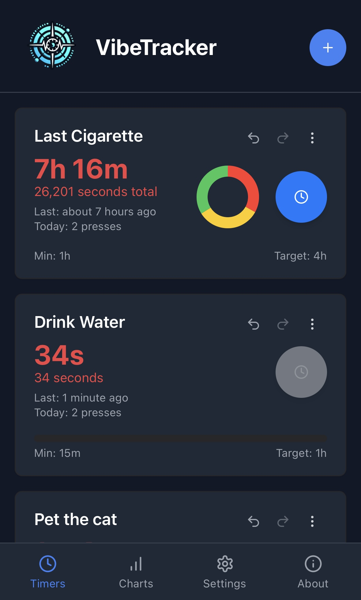
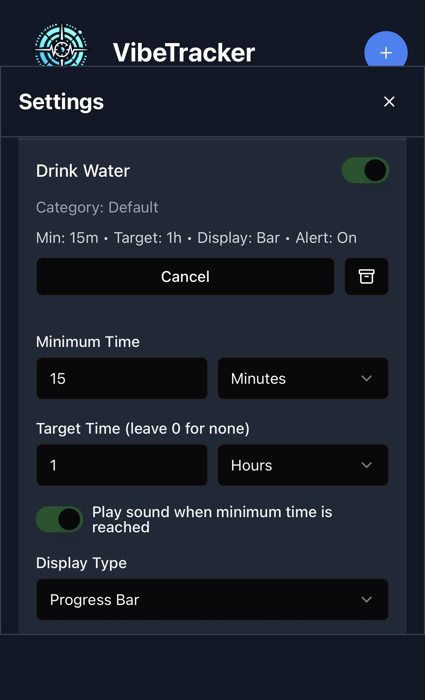
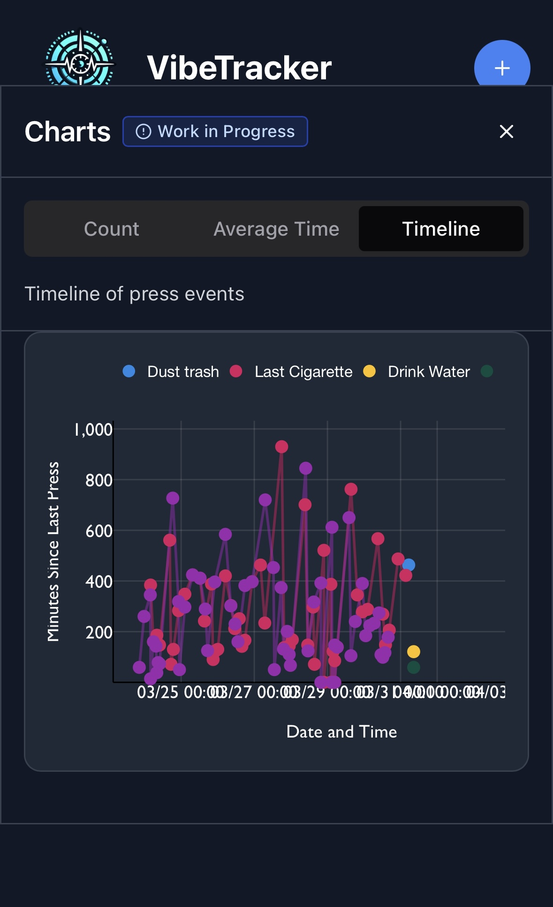
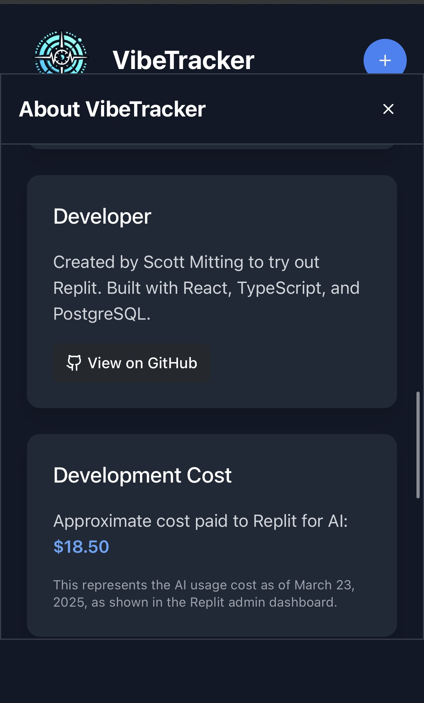

# VibeTracker

  

A dynamic time tracking mobile application designed to transform productivity management into an engaging, visually compelling experience. The app combines intuitive design with powerful analytics to help users understand and optimize their time usage.

# Screenshots

    
    
    
  

# Replit

I created this project to learn how to use Replit to develop software without writing code.  I am very impressed with what I've been able to do wothout touching the code. I am goong to use a mix of this eith my Cursor account in the future when I dont need this level of power, but I expect to use this a lot.  

If you want to try it, help me out by clicking this affiliate link. 
[https://replit.com/refer/gmitting2]

## Quick Start

This app is currently available
free of charge at [https://tinyurl.com/vibe-tracker/]

## Features

- Multiple customizable timers that show elapsed time since the last button press
- Custom labels for each timer (e.g., "Last cigarette", "Fed cat")
- Undo/redo functionality for accidental clicks
- Daily and weekly charts for tracking habits over time
- Compare historical data with visualization
- Configurable minimum times, maximum targets, and sound notifications per timer
- Archive system for timers rather than permanent deletion
- Multi-user functionality with secure authentication
- Password recovery system with security questions and PIN
- View, edit, and delete press history for each timer
- Dark mode support

## Technology Stack

- React with TypeScript for type-safe code
- Victory.js for interactive data visualizations
- Date-fns for precise time calculations
- Shadcn/ui for modern, responsive component design
- Custom React hooks for efficient state management
- PostgreSQL database with Drizzle ORM
- Express.js backend

## Getting Started

### Prerequisites

- Node.js 18+
- PostgreSQL database

### Installation

1. Clone the repository
2. Install dependencies: `npm install`
3. Start the development server: `npm run dev`

## License

This project is licensed under the MIT License - see the LICENSE file for details.
